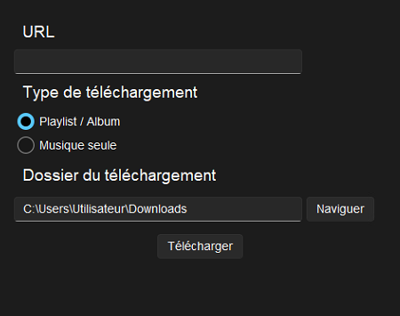
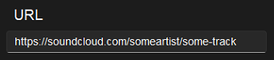
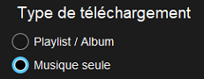
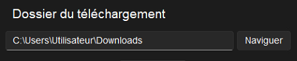
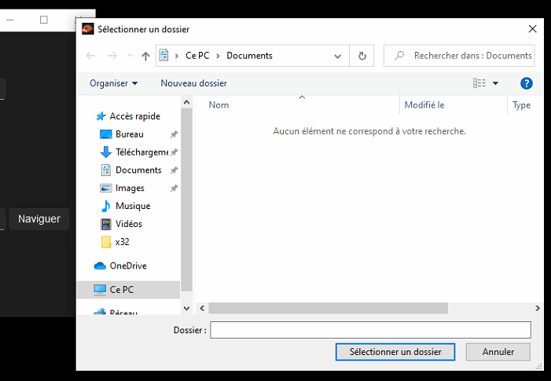
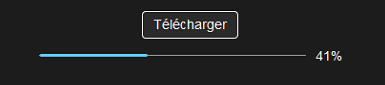
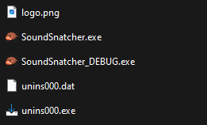

# SoundSnatcher
_A simple GUI app that allows you to download music from Spotify, YouTube or SoundCloud from a link. The app also supports downloading entire playlists or albums at once._

## URL 

Here, you can paste a link to a song or playlist you would like to install. Supported platforms are Youtube, Spotify and SoundCloud.

## Download choice 

Thanks to this selector, you can choose to install either a playlist/album or a single track.

## Output Directory

By default, this entry points to the user's download folder. You can click the browse button on the right to be prompted with a file dialog.

## Downloading
Once you have configured a download, you can click the download button. The progression will be shown on a progress bar and the current download percentage will also be shown.

## Error handling and reporting
Since the app does not send error messages to the user (for the time being), a debug version of the app is distributed alongside the main app. This version will allow you to see tracebacks for any error through a shell. You can find the debug version in the same folder as the app executable.

You can find the app executable by searching for "Sound Snatcher" in the **start menu**, **right-clicking** it and selecting **Open File Location**. Then repeat the same process on the shortcut by  **right-clicking** it and selecting **Open File Location**. At this point, you should be faced with the following folder contents:

If you encounter any bugs, please report them including the stack trace.
